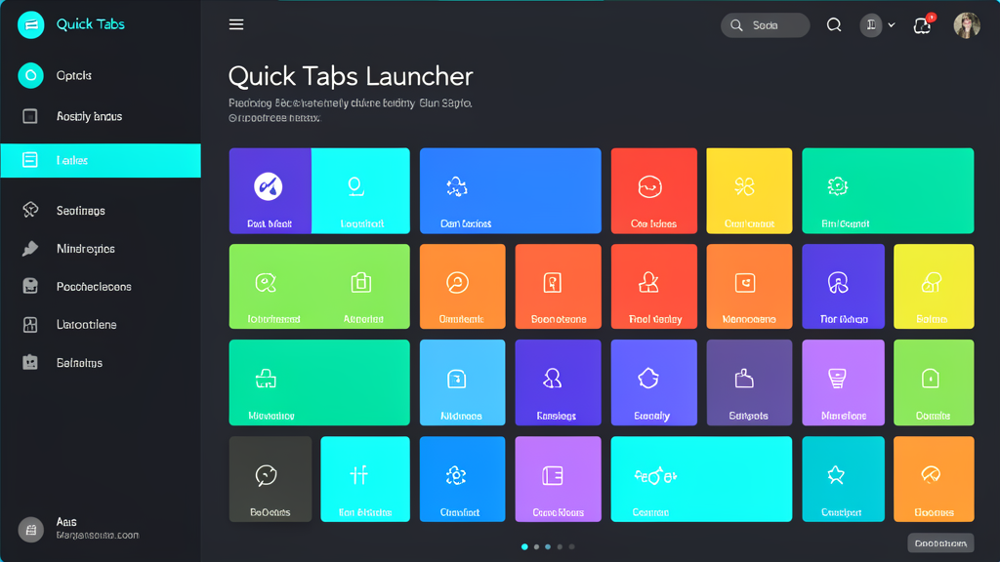
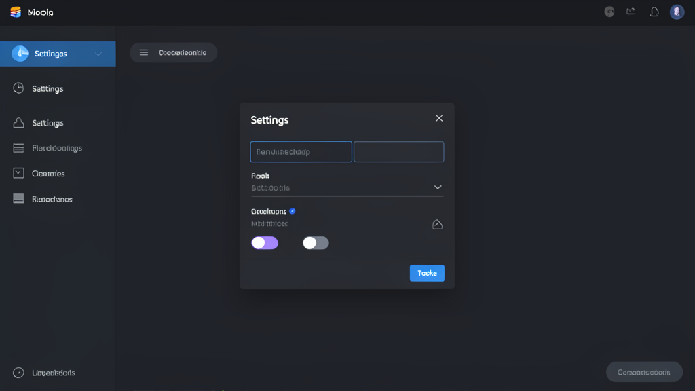
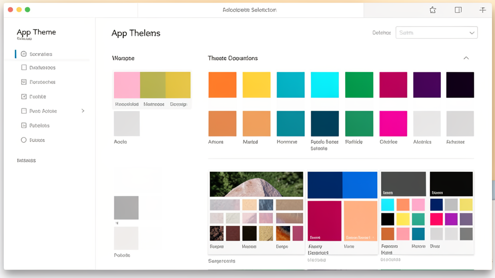

# ⚡ Quick Tabs Launcher


Lightweight desktop app for managing your browser tabs and groups. Open all active tabs with one click, organize them into groups, and launch everything in your default browser.

## Download

Go to [Releases](../../releases) and download `Quick Tabs Launcher Setup 1.0.0.exe`. Run the installer — no extra dependencies required.

## Features

- ➕ Add tabs with name + URL — no strict protocol required
- 📁 Create groups of tabs
- ▶ One-click START to open all active tabs in your default browser
- ✏️ Rename, toggle active/inactive, delete, refresh favicon
- 🎨 10 built-in color themes with application-wide background support
- 🖥️ Frameless custom titlebar with fast, distraction-free UI
- 💾 Settings apply instantly — no Save button needed
- 🚀 Autostart toggle styled like active/offline status
- 🧹 Auto cleanup of orphaned tabs and groups on launch
- 🪟 Custom app icon on Windows installer and taskbar

## Advantages

- No browser needed to manage tabs — standalone desktop app
- No account, no cloud, no telemetry — fully local
- Fast startup, small footprint, portable mode available
- Works offline for tab management; opens links in your default browser
- Compact UI: sidebar always visible, adaptive layout, readable inputs in all themes

## Screenshots

### Main UI


### Settings


### Themes


## Build from source

Requires **Node.js 18+**:

```bash
npm install
npm run build    # Windows installer → dist/Quick Tabs Launcher Setup 1.0.0.exe
```

## Tech stack

- **Electron 28**
- **electron-builder** for Windows packaging
- Portable HTML/CSS/JS frontend

## License

MIT
